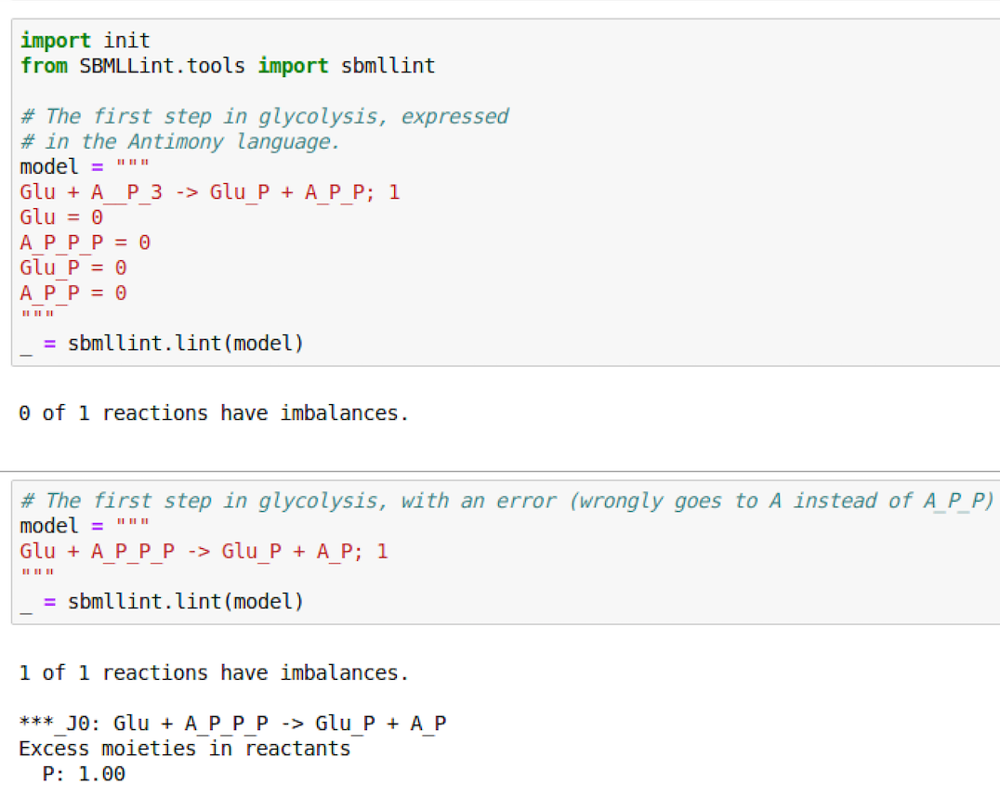
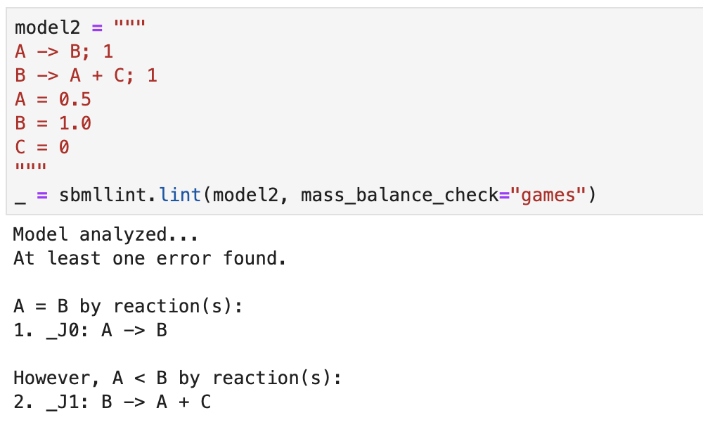

# SBMLlint

## Problem Addressed

Many biological models are based on chemical reactions. For example, glycolysis, arguably the most widely exercised metabolic pathway in biology, begins by transforming the reactants glucosue (Glu) and adenosine triphosphate (ATP) into the products glucose 6-phosphate (GluP) and adenosine diphosphate (ADP), or: ``Glu + ATP -> GluP + ADP``. Examples of biological modeling techniques that rely on reactions include flux balance analysis and kinetics models.

Today's biological models typically consist of tens to hundreds of reactions. Even with this modest level of complexity, it is easy to make mistakes. For example, a **mass balance error** occurs if the total mass of the reactants differs from the total mass of the products. With the advent of high throughput laboratory techniques, the complexity of models will grow rapidly. As a point of comparison, the complexity of typical software packages has grown from hundereds of lines of code in the 1960s to tens of millions of lines of code for software such as linux and the Apache web server.

Because of this huge growth in the complexity, software engineers developed sophisticated tools to detect errors in codes *statically*, before any statement is executed. For example, the ``pylint`` tool analyzes ``python`` source codes to determine if a variable is referenced before a value is assigned to it. The term **linter** is used for a tool that does static analysis of source codes.

## The Tool

``SBMLLint`` is a tool that lints reactions. The initial focus is detecting mass balance errors. The tool takes as input a model expressed in either SBML ([Systems Biology Markup Language](http://sbml.org/Main_Page), a standard format for biochemical models) or the [Antimony language](http://antimony.sourceforge.net/) (a human readable representation of chemical reaction models).

``SBMLLint`` implements two algorithms for linting reactions. The first, ``structured_names``, requires the modeller to give the tool hints by naming molecules in terms of their underlying moieties (sub-parts). For example, ``ATP`` would be written as ``A_P_P_P`` to indicate that there is one adenosine molecule and three phosphate molecules. Similarly, ``GluP`` would be written as ``Glu_P``. Thus, the above reaction is written as ``Glu + A_P_P_P -> Glu_P + A_P_P``. ``structured_names`` checks that the count of each moiety in the reactants is the same as the count of each moiety in the products. Although ``structured_names`` places a burden on the modeller, we note that about 20% of the models in the [BioModels](http://www.ebi.ac.uk/biomodels/) repository already use names structured in the manner required by this tool. 

The second algorithm, ``games`` (Graphical Analysis with Mass Equality Sets) does not impose any requirements on the structure of the molecule names. However, ``games`` checks for a weaker condition called *stoichiometric inconsistency*. A collection of reactions is stoichiometrically inconsistent if the set of reactions infers that a molecule has more than one relative mass. To illustrate this, consider two reactions ``A -> B + C`` and ``C -> A``. The first reaction implies that the mass of ``A`` is greater than the mass of ``C``. But the second reaction implies that ``A`` and ``C`` have the same mass.

## Examples
The following is an example of using the ``structured_names`` and ``games`` algorithms to check for mass balance in a Jupyter Notebook.
``SBMLLint`` can also be run from the command line, taking as input a file with either SBML or Antimony. 

## Installation and Usage

1. Install python 3.6 or higher
1. Install [git](https://git-scm.com/book/en/v2/Getting-Started-Installing-Git). To see if git is already installed on your machine:
   - Open a terminal session.
   - Type ``git --version``. If a git version number is returned, then git is installed.
1. Install [miniconda](https://docs.conda.io/projects/conda/en/latest/user-guide/install/)
1. Clone the repository using ``git clone https://github.com/ModelEngineering/SBMLLint.git``
1. Change directory to the repo using ``cd SBMLLint``
1. Decompress the BioModels files. On Windows, use ``winzip``. On mac and linux, use:
   - ``cd data/biomodels``
   - ``unzip BIOMODELS.zip``
   - ``cd ../..``
1. Create a miniconda virtual environment  with dependencies
using ``conda env create -f environment.yml``
1. Start a new terminal session and change directory to ``SBMLLint``.
1. Activate the virtual environment using ``conda activate sbmllint``
1. Install Tellurium using ``pip install tellurium``
1. Deactivate the virtual environment using ``conda deactivate``

To do GAMES and moiety analysis from the command line for a file path:
1. Start a new terminal session.
1. Change directory to the cloned repository.
1. Activate the virtual environment
1. There are copies of several BioModels files in ``data/biomodels`` or ``data\biomodels`` in Windows.
Use ``/`` or ``\``  as appropriate for your system in the following instructions.
   - To run games for a file in this directory, use
``python SBMLLint/tools/games.py data/biomodels/<file name>``
   - To run moiety analysi for a file in this directory, use
``python SBMLLint/tools/moiety\_analysis.py data/biomodels/<file name>``
1. Deactivate the virtual environment

Note: to change implicit molecules or moieties, edit the file
``.sbmllint_cfg`` in the subfolder ``SBMLLint``.
