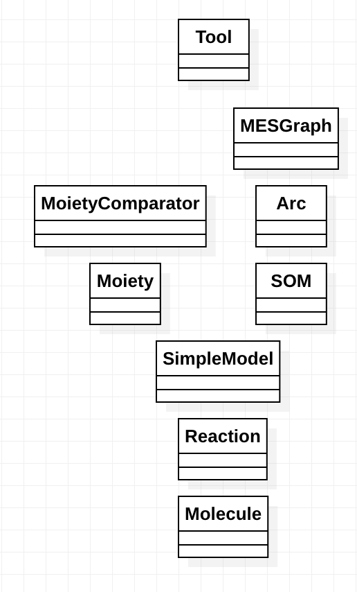

# Component Specification

This document describes the major classes in SBMLLink and the relationships between them.

The diagram depicts the component hierarchy.
If component A is above B then A knows about B but but does not know about A.
Components at the same level do not know about each other.

Below, we describe each component.

- Molecule. A representation for a chemical structure. A molecule has a namethat uniquely identifies the object.

- Reaction. A representation of the transformation of a set of molecules (reactants) into another set of molecules (products).
A reaction is uniquely identified by an identifier (a string representation
of the reaction, including its kinetics law).
