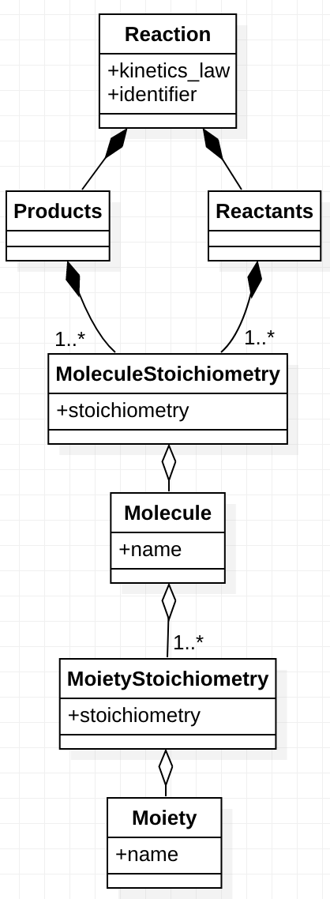

# Component Specifications

This document describes the major classes in SBMLLink and the relationships between them.

The diagram depicts the component hierarchy.
If component A is above B then A knows about B but but does not know about A.
Components at the same level do not know about each other.

Below, we describe each component.

- Molecule. A representation for a chemical structure. A molecule has a namethat uniquely identifies the object.

- Reaction. A representation of the transformation of a set of molecules (reactants) into another set of molecules (products).
A reaction is uniquely identified by an identifier (a string representation
of the reaction, including its kinetics law).

- SimpleModel. A representation of the SBML model.

- Moiety. A chemical group within a molecule.

- SOM. A set of molecules.

- MoietyComparator. Reports on the differences between two the occurrences of moieties within a set of molecules.

- Arc. Indicates a relationship between two SOMs.

- MESGraph. Used to make inferences about the inequalities of masses of molecules.

- Tool. A command line analysis done on an SBML file.

We refine the foregoing by looking at the more detailed relationships
between classes in the following diagram.

The graph can be summarized as follows.

A Reaction has a kinetics, law, a unique identifier, Reactants,
and Products. The latter two are collections of MoleculeStoichiometry,
a molecule with its stoichiometry.
A Molecule has a name. It can be structured
into one or more MoietyStoichiometry. 
For example, the molecule `ATP` can be written
in terms of its moieties as `A_P_P_P` or, using repetition counts,
`A__P_3`. `A` and `P` are moieties, and `P_3` is a moiety with its
stoichiometry.
